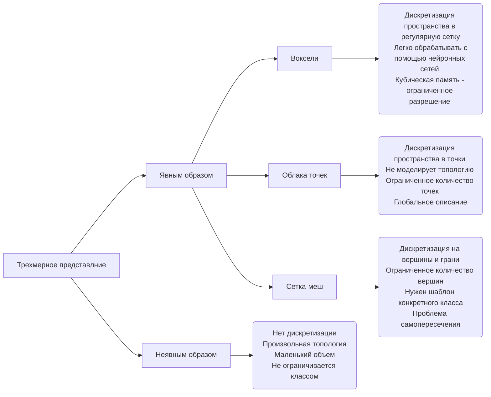
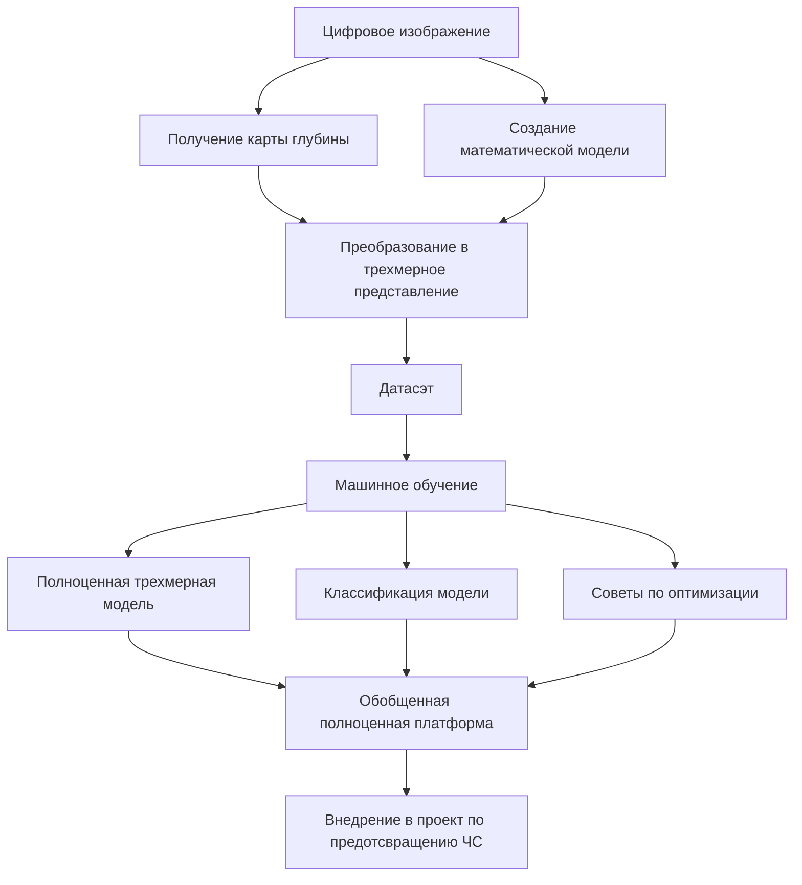
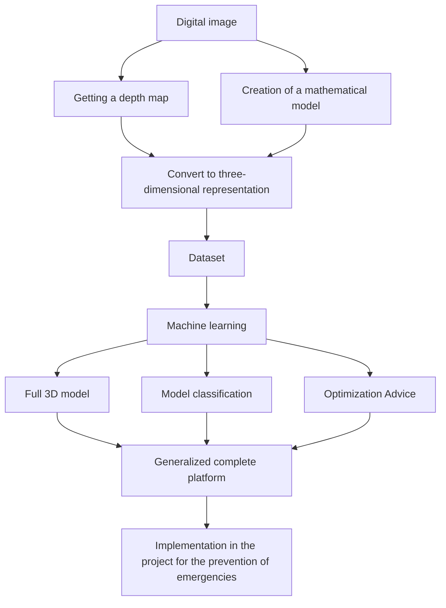
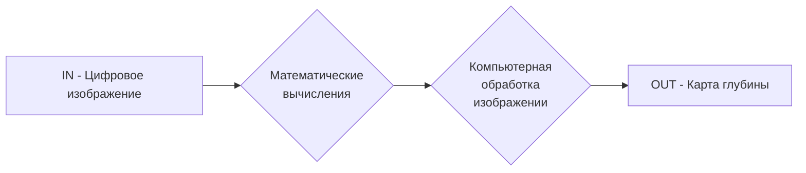
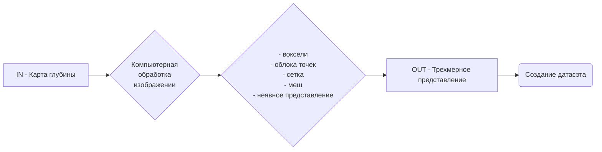
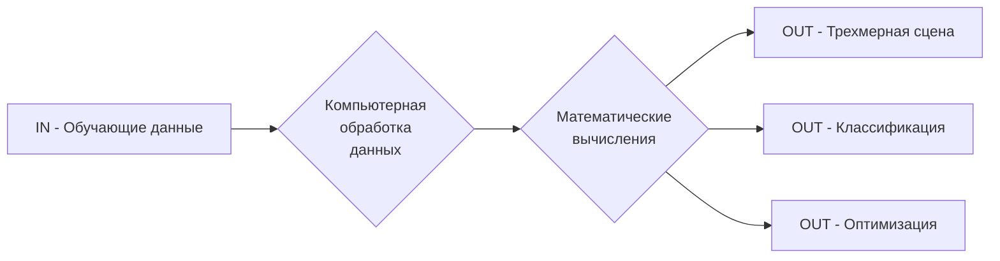

# UNRELATED SCHEMES

------

#### Схема №1. Виды трехмерного представления

------

#### Схема №2. (1 курс) Структура диссертации. Описание предположительных методов и моделей.

##### Целостная структура

##### Разработка цифровой модели, формирующей карту глубины из RGB изображений

##### Построение модели для получения обучающего датасэта с помощью карты глубины преобразованного в трехмерное представление 

##### Разработка модели обучения трехмерного представления на основе обучающих данных 

